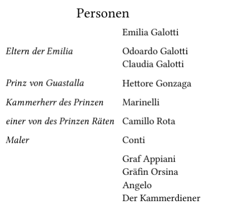
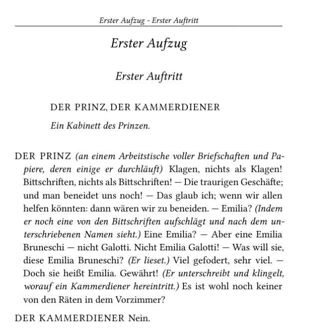

# Emilia Galotti - Typst Drama Template

This repository showcases the use of [Typst](https://typst.app/) for formatting screenplays using a custom template `drama.typ`. The primary purpose is to demonstrate how to format classic dramas, like _Emilia Galotti_ by Gotthold Ephraim Lessing, in a well-structured way. The first act of _Emilia Galotti_ is provided here as an example of how to use the `drama.typ` template.

## Repository Contents

- **drama.typ**: A Typst template that provides functions and structures for formatting a drama, including acts, scenes, character lines, stage directions, and character lists.
- **main.typ**: The first act of _Emilia Galotti_ formatted with `drama.typ`.

## Features of the `drama.typ` Template

### Template Components

- **`act(title, body)`**: Formats each act with the title centered and includes the body of the act.
- **`scene(title, body)`**: Formats each scene, centering the title and adding the scene body.
- **`scene-description(body)`**: Formats the scene description in an inset block, used for stage directions at the beginning of a scene.
- **`regie(body)`** and **`inline-regie(body)`**: Italicizes stage directions, where `regie` is for full paragraphs and `inline-regie` is for inline directions within dialogue.
- **`setupDrama(title, characters, numbering, paper)`**: Initializes the drama document with a title, character list, and custom page settings.

### Usage

1. **Define Characters**:
   Each character is defined with a full name and, optionally, a shortened name. For example:
   ```typst
   let emilia = (full: "Emilia Galotti", short: "Emilia")
   ```
2. **Initialize the Drama**:
   The setupDrama function is used to set up the play’s metadata, such as title and character list.
   It returns dictionaries that maps the characters to
   functions. Example:

   ```typst
   let (character-table, character-speaks,
       character-dict, character-print-dict,
       template) = setupDrama(
       title: "Emilia Galotti",
       paper: "a5",
       characters:
       (
       (description: "", characters: (emilia)),
       (description: "Eltern der Emilia", characters: (odoardo, claudia)),
       )
   )
   ```

   the `characterTable()` function produces a nicely formatted Table of all Characters in the drama.

   

   You can then use the template

   ```typst
   #show template
   ```

3. **Creating Acts and Scenes**:
   Use `act`and `scene` to define the structure.
   For example:

   ```typst
   #act("Erster Aufzug")[
       #scene("Erster Auftritt")[
           #scene-description[
               //scene-characters is a custom function
               #scene-characters((prinz, kammerdiener))
               #regie[Ein Kabinett des Prinzen.]
           ]
           #prinzsays(instructio: "(an einem
           Arbeitstische voller Briefschaften und
           Papiere, deren einige er durchläuft)")[
           Klagen, nichts als Klagen! Bittschriften,
           nichts als Bittschriften! --- Die
           traurigen Geschäfte; und man beneidet
           uns noch! --- Das glaub ich; wenn wir
           allen helfen könnten:
           dann wären wir zu beneiden. --- Emilia?
           #inline-regie[Indem er noch eine von den
           Bittschriften aufschlägt und nach dem
           unterschriebenen Namen sieht.] Eine
           Emilia? --- //truncated
           ]
           #kammerdienersays[Nein.]
       ]
   ]
   ```

   

4. **Retrieve character speech functions**

   Use the dictionary to retrieve the character speech functions like this:

   ```typst
       #let prinzsays = character-speaks.der-prinz
   ```

   Also if you want to print the character names you can
   use the character-print-dict

   ```typst
       #let camillo = character-print-dict.camillo
       #regie[#camillo is going away]
   ```

   The `character-dict` is simply to retrieve all character names as string.

For more information feel free to look at the example
